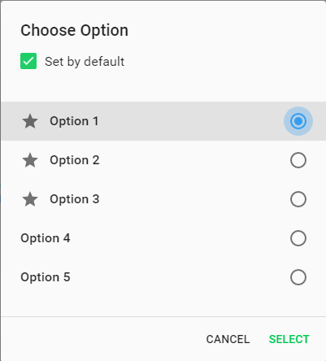

#    Generic Dialogs

Pip.WebUI.Dialogs modules contains general purpose dialogs.

- Information message dialog
- Confirmation message dialog
- Error message dialog
- Option selection dialog
- Big option selection dialog with additional discription in *subtitle* filed.

##  pipInformationDialog

**pipInformationDialog** show dialog with information message and OK button.

See online samples [here...](http://webui.pipdevs.com/pip-webui-dialogs/index.html#/information)

##  pipConfirmationDialog

**pipConfirmationDialog** shows message with question and YES and NO buttons.

See online samples [here...](http://webui.pipdevs.com/pip-webui-dialogs/index.html#/confirmation)

##  pipErrorDialog

**pipErrorDialog** shows error message with collapsible details.

See online samples [here...](http://webui.pipdevs.com/pip-webui-dialogs/index.html#/error_details)

##  pipOptionsDialog

**pipOptionsDialog** allows to pick one from several available options.

See online samples [here...](http://webui.pipdevs.com/pip-webui-dialogs/index.html#/options)

Option dialog with additional option

See online samples [here...](http://webui.pipdevs.com/pip-webui-dialogs/index.html#/options)

##  pipOptionsBigDialog

**pipOptionsBigDialog** allows to pick one from several available options. Each option can have additional discription in *subtitle* filed.

Option dialog with subtitles.

See online samples [here...](http://webui.pipdevs.com/pip-webui-dialogs/index.html#/options)

Option dialog with subtitles and without action button.

See online samples [here...](http://webui.pipdevs.com/pip-webui-dialogs/index.html#/options)

Option dialog with subtitles, with title hint and without action button.

See online samples [here...](http://webui.pipdevs.com/pip-webui-dialogs/index.html#/options)

## Learn more about the module

- [User's guide](https://github.com/pip-webui/pip-webui-dialogs/blob/master/doc/UsersGuide.md)
- [Online samples](http://webui.pipdevs.com/pip-webui-dialogs/index.html)
- [API reference](http://webui-api.pipdevs.com/pip-webui-dialogs/index.html)
- [Developer's guide](https://github.com/pip-webui/pip-webui-dialogs/blob/master/doc/DevelopersGuide.md)
- [Changelog](https://github.com/pip-webui/pip-webui-dialogs/blob/master/CHANGELOG.md)
- [Pip.WebUI project website](http://www.pipwebui.org)
- [Pip.WebUI project wiki](https://github.com/pip-webui/pip-webui/wiki)
- [Pip.WebUI discussion forum](https://groups.google.com/forum/#!forum/pip-webui)
- [Pip.WebUI team blog](https://pip-webui.blogspot.com/)

## Module dependencies

* [pip-webui-lib](https://github.com/pip-webui/pip-webui-lib): angular, angular material and other 3rd party libraries
* [pip-webui-css](https://github.com/pip-webui/pip-webui-css): CSS styles
* [pip-webui-services](https://github.com/pip-webui/pip-webui-services): localization and other core services

## License

This module is released under [MIT license](License) and totally free for commercial and non-commercial use.
