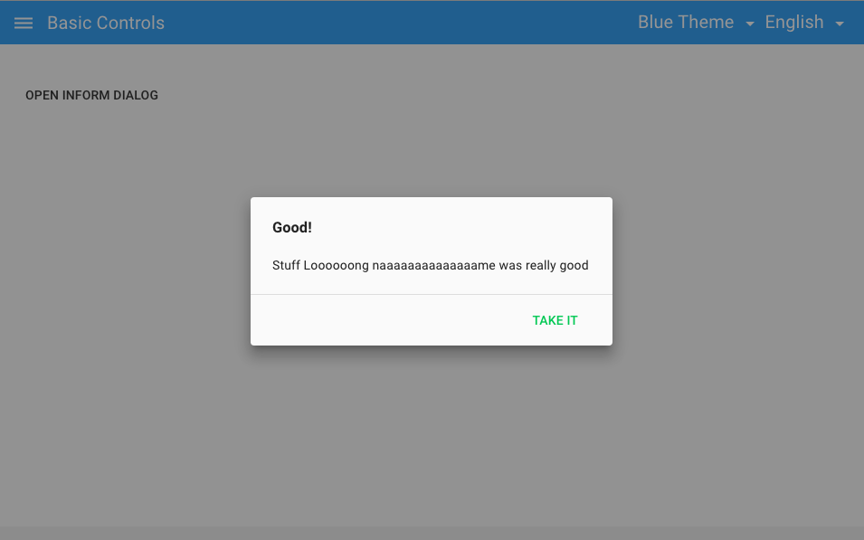
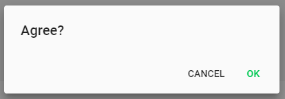
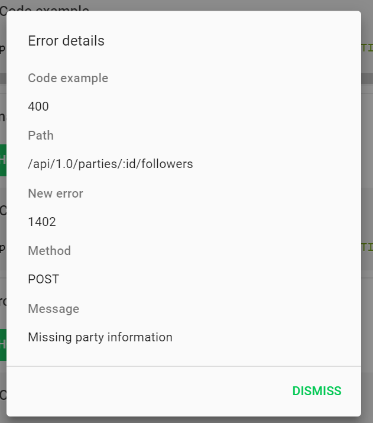
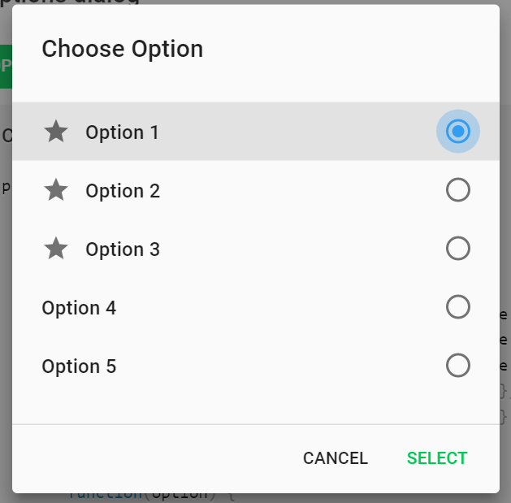
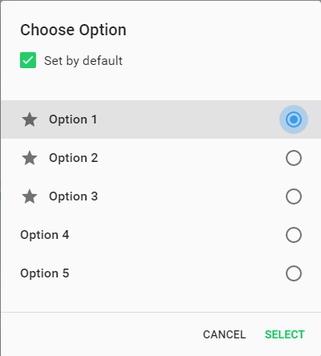
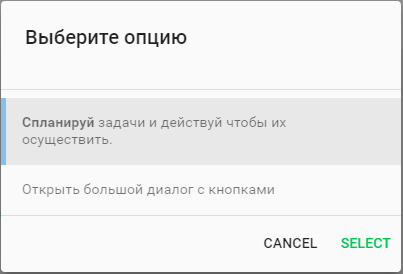
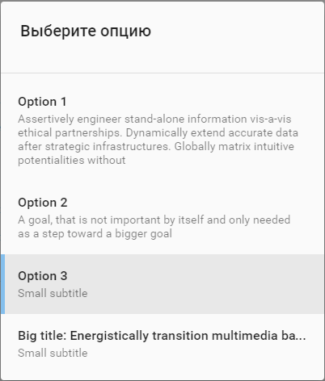
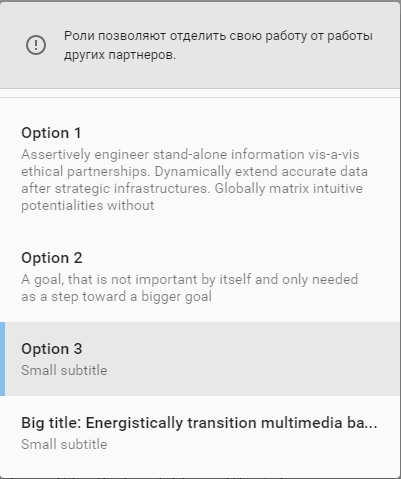

# Pip.WebUI.Dialogs User's Guide

## <a name="contents"></a> Contents
- [Installing](#install)
- [pipInformationDialog](#information_dialog)
- [pipConfirmationDialog](#confirmation_dialog)
- [pipErrorDialog](#error_dialog)
- [pipOptionsDialog](#error_dialog)
- [Questions and bugs](#issues)


## <a name="install"></a> Installing

Add dependency to **pip-webui-ws** into your **bower.json** or **package.json** file depending what you use.
```javascript
"dependencies": {
  ...
  "pip-webui-ws": "*"
  ...
}
```

Alternatively you can install **pip-webui** manually using **bower**:
```bash
bower install pip-webui-ws
```

or install it using **npm**:
```bash
npm install pip-webui-ws
```

Include **pip-webui-ws** files into your web application.
```html
<link rel="stylesheet" href=".../pip-webui-lib.min.css"/>
<link rel="stylesheet" href=".../pip-webui.min.css"/>
...
<script src=".../pip-webui-lib.min.js"></script>
<script src=".../pip-webui.min.js"></script>
```

Register **pipDialogs** module in angular module dependencies.
```javascript
angular.module('myApp',[..., 'pipDialogs']);
```

## <a name="information_dialog"></a> pipInformationDialog

**pipInformationDialog** show dialog with information message and OK button.

### Usage
```javascript
 pipInformationDialog.show(
        {
            event: event,
            title: 'Good!',
            message: 'Stuff %s was really good',
            item: 'Loooooong naaaaaaaaaaaaaame',
            ok: 'Take It'
        },
        function () {
            console.log('Taken');
        }
    );
```
### Parametrs
| Parametr | Type | Description | 
|---|---|---|
| event | MouseEvent | Mouse event |
| ok | string | Confirm button caption |
| title | string | Dialog title |
| message | string | Dialog messag. You can use formatting options (%s, %d etc.) |
| item | any | Paramentrs for message string |

### Methods
* **show** - open information dialog

Information dialog



See online samples [here...](http://webui.pipdevs.com/pip-webui-dialogs/index.html#/information)

## <a name="confirmation_dialog"></a> pipConfirmationDialog

**pipConfirmationDialog** shows message with question and YES and NO buttons.

### Usage
```javascript
 pipConfirmationDialog.show(
        {
            event: event,
            title: 'Agree?',
            ok: 'Agree',
            cancel: 'Disagree'
        },
        function () {
            console.log('You agreed');
        },
        function () {
            console.log('You disagreed');
        }
    );
```

### Parametrs
| Parametr | Type | Description | 
|---|---|---|
| event | MouseEvent | Mouse event |
| ok | string | Confirm button caption |
| title | string | Dialog title |
| cancel | string | Cancel button caption |

### Methods
* **show** - open confirmation dialog

Confirmation dialog



See online samples [here...](http://webui.pipdevs.com/pip-webui-dialogs/index.html#/confirmation)

## <a name="error_dialog"></a> pipErrorDialog

**pipErrorDialog** shows error message with collapsible details.

### Usage
```javascript
 pipErrorDetailsDialog.show(
     {
         error: $scope.error,
         ok: 'Ok'
     },
     function () {},
     function () {}
 );
```

### Parametrs
| Parametr | Type | Description | 
|---|---|---|
| event | MouseEvent | Mouse event |
| ok | string | Confirm button caption |
| cancel | string | Error object or string |
| error | any | Cancel button caption |

### Methods
* **show** - open errors details dialog

Error details dialog



See online samples [here...](http://webui.pipdevs.com/pip-webui-dialogs/index.html#/error_details)

## <a name="options_dialog"></a> pipOptionsDialog

**pipOptionsDialog** allows to pick one from several available options.

### Usage
```javascript
 pipOptionsDialog.show(
        {
            event: event,
            title: 'Choose Option',
            options: [
                { icon: 'star', name: 'option_1', title: 'Option 1', active: true },
                { icon: 'star', name: 'option_2', title: 'Option 2' },
                { icon: 'star', name: 'option_3', title: 'Option 3' },
                { name: 'option_4', title: 'Option 4' },
                { name: 'option_5', title: 'Option 5' }
            ]
        },
        function(option) {
            var optionName = option ? option.name : null;
            console.log('Selected option: ' + optionName);
        }
    );
```

### Parametrs
| Parametr | Type | Description | 
|---|---|---|
| event | MouseEvent | Mouse event |
| title | string | Dialog title |
| ok | string | confirm button title |
| selectedOption | OptionsDialogData {name: string, title: string, icon?: string, active?: boolean} | Cancel button caption |
| options | OptionsDialogData[]   | Dialog options array |
| selectedOptionName | string | Selected Option Name |
| isCheckboxOption | boolean | Value for additional option |
| checkboxOptionCaption | any | Checkbox caption, additional option visible if caption is set |


### Methods
* **show** - open options dialog

Option dialog



See online samples [here...](http://webui.pipdevs.com/pip-webui-dialogs/index.html#/options)

Option dialog with additional option



See online samples [here...](http://webui.pipdevs.com/pip-webui-dialogs/index.html#/options)

## <a name="options_big_dialog"></a> pipOptionsBigDialog

**pipOptionsBigDialog** allows to pick one from several available options. Each option can have additional discription in *subtitle* filed.

### Usage
```javascript
    var options = [
        { name: 'option_1', title: 'Option 1', subtitle: 'Assertively engineer stand-alone information vis-a-vis ethical partnerships. Dynamically extend accurate data after strategic infrastructures. Globally matrix intuitive potentialities without' },
        { name: 'option_2', title: 'Option 2', subtitle: 'A goal, that is not important by itself and only needed as a step toward a bigger goal' },
        { name: 'option_3', title: 'Option 3', subtitle: 'Small subtitle' },
        { name: 'option_4', title: 'Big title: Energistically transition multimedia based ideas without mission-critical schemas. 4', subtitle: 'Small subtitle' }

    ];
    pipOptionsBigDialog.show(
        {
            event: event,
            noActions: true,
            noTitle: true,
            hint: 'Роли позволяют отделить свою работу от работы других партнеров.',
            options: options,
            selectedOptionName: $scope.activeOptionName
        },
        function (result) {
            var optionName = result && result.option ? result.option.name : null;
            setActive(options, optionName);
            console.log('Selected option: ' + optionName);
        }
    );
```

### Parametrs
| Parametr | Type | Description | 
|---|---|---|
| event | MouseEvent | Mouse event |
| title | string | Dialog title |
| ok | string | confirm button title |
| selectedOption | OptionsDialogData {name: string, title: string, icon?: string, active?: boolean} | Cancel button caption |
| options | OptionsDialogData[]   | Dialog options array |
| selectedOptionName | string | Selected Option Name |
| hint | string | Dialog hint title |
| noTitle | boolean | Title is hide |
| noActions | boolean | Action button is hide. When you select an option, the dialog is closed. |

### Methods
* **show** - open options dialog

Option dialog with subtitles.



See online samples [here...](http://webui.pipdevs.com/pip-webui-dialogs/index.html#/options)

Option dialog with subtitles and without action button.



See online samples [here...](http://webui.pipdevs.com/pip-webui-dialogs/index.html#/options)

Option dialog with subtitles, with title hint and without action button.



See online samples [here...](http://webui.pipdevs.com/pip-webui-dialogs/index.html#/options)

## <a name="issues"></a> Questions and bugs

If you have any questions regarding the module, you can ask them using our 
[discussion forum](https://groups.google.com/forum/#!forum/pip-webui).

Bugs related to this module can be reported using [github issues](https://github.com/pip-webui/pip-webui-dialogs/issues).
